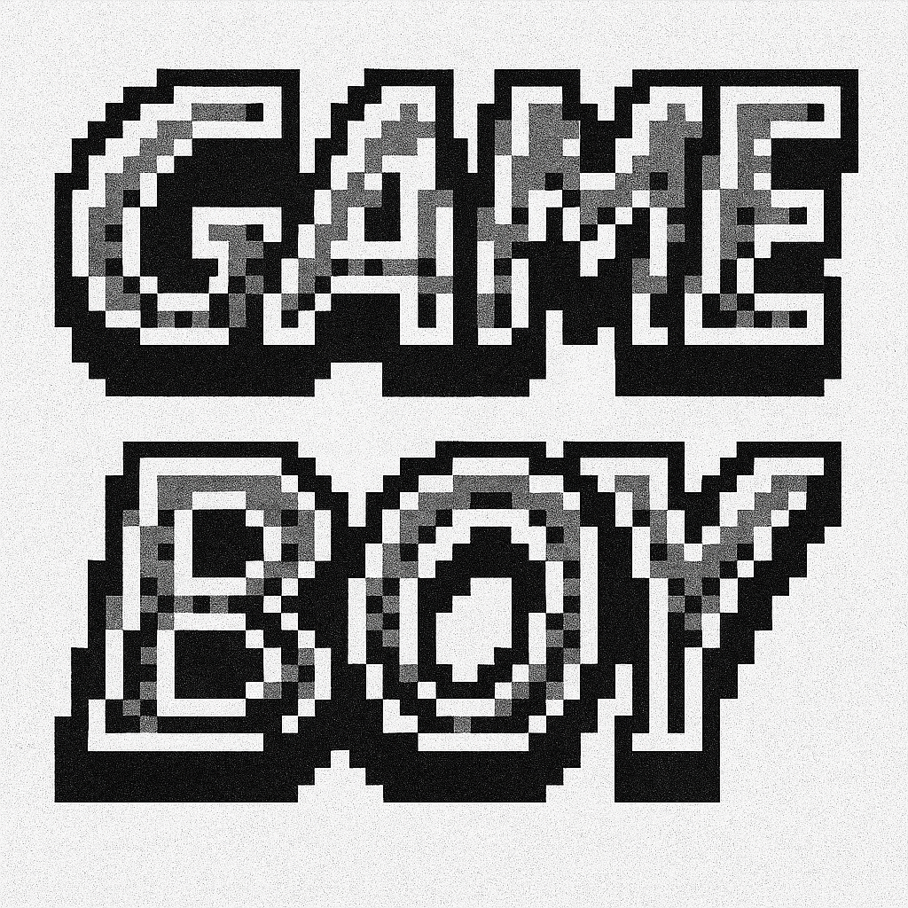

# GameBoy2

GameBoy2 is an Arduino-based handheld game console project using a 128×64 ST7920 monochrome graphical LCD, physical buttons, and an analog joystick.

The firmware integrates multiple games under a shared menu and state-management architecture. Display rendering is handled by U8g2, while Arduino FreeRTOS is used for task scheduling.

> Current code is best suited to an Arduino Mega 2560 or another compatible board that exposes Digital Pin 31. The Dino module currently uses D31 directly.

## Project Overview



The project currently contains the following modes:

| Mode | Status | Description |
|---|---|---|
| Snake | Playable | Classic Snake game with joystick control, scoring, and selectable speed |
| Chess | Integrated | Lightweight chess implementation based on the included Little Rook Chess module |
| Breakout | Playable | Paddle-and-ball brick breaker with lives and selectable speed |
| Dino | Playable | Endless-runner game with jumping, obstacles, scoring, and progressive speed |
| Logo View | Available | Displays stored bitmap graphics |
| City Drive | Prototype | Initial racing-scene and lane-control implementation; gameplay is still under development |

## Hardware Requirements

Recommended hardware:

- Arduino Mega 2560 or compatible board
- ST7920 128×64 graphical LCD
- Four momentary push buttons
- Two-axis analog joystick
- Breadboard or equivalent wiring platform
- Suitable power source

### Pin Assignment

| Function | Arduino Pin |
|---|---:|
| Right button | D4 |
| Left button | D5 |
| Up button | D6 |
| Down button | D7 |
| Joystick X | A1 |
| Joystick Y | A0 |
| ST7920 Clock | D13 |
| ST7920 Data | D11 |
| ST7920 CS | D10 |
| ST7920 Reset | D9 |
| Dino auxiliary output | D31 |

The directional buttons use `INPUT_PULLUP`, therefore a pressed button is read as `LOW`.

ST7920 module pin labels may vary between manufacturers. Verify the display module's serial-mode configuration and voltage requirements before connecting the hardware.

## Controls

### Main Menu

| Input | Action |
|---|---|
| Up / Down | Move through the menu |
| Left | Select the highlighted mode |
| Right | Return to the splash screen |

### Snake

| Input | Action |
|---|---|
| Joystick | Control movement |
| Up / Down | Select speed level |
| Left | Start game |
| Down during gameplay | Return to menu |
| Right on score screen | Return to menu |

### Breakout

| Input | Action |
|---|---|
| Joystick X | Move paddle |
| Up / Down | Select speed level |
| Left | Confirm speed / start |
| Up | Launch the ball |
| Right | Return to menu |

### Dino

| Input | Action |
|---|---|
| Up | Jump |
| Right | Duck or return to menu after game over |

### Chess

| Input | Action |
|---|---|
| Up / Down | Navigate |
| Left | Back / home action |
| Right | Select |

### City Drive

| Input | Action |
|---|---|
| Left / Right | Change lane state |
| Down | Return to menu |

## Software Architecture

The firmware is organized as a set of independent game modules coordinated by a shared application state.

```text
GameBoy2/
├── GameBoy2.ino
├── GameState.h
├── SnakeGame.h
├── SnakeGame.cpp
├── LittleRookChess.h
├── LittleRookChess.cpp
├── BreakoutGame.h
├── BreakoutGame.cpp
├── DinoGame.h
├── DinoGame.cpp
├── CityDriveGame.h
├── CityDriveGame.cpp
├── gameboy_title_pixels.h
├── controller_logo_pixels.h
├── snake_logo_pixels_new.h
└── racing_scene_pixels.h
```

### Application State

Top-level screens and games are represented through the `GameState` enum.

```cpp
enum GameState {
  STATE_SPLASH,
  STATE_GAME_MENU,
  STATE_SNAKE_SPEED,
  STATE_SNAKE_GAME,
  STATE_SNAKE_SCORE,
  STATE_BREAKOUT_GAME,
  STATE_DINO_GAME,
  STATE_CHESS_GAME,
  STATE_LOGO_VIEW,
  STATE_CITY_DRIVE_GAME
};
```

A simplified runtime flow is:

```text
Power On
   |
   v
Splash Screen
   |
   v
Game Menu
   |
   +-- Snake
   +-- Chess
   +-- Breakout
   +-- Dino
   +-- Logo View
   +-- City Drive
   |
   v
Return to Game Menu
```

### FreeRTOS Tasks

The current firmware creates two primary tasks:

```text
TaskDisplayLCD
  Handles splash screen, menu, game updates, and rendering.

TaskHandleButton
  Polls joystick input used by the Snake module.
```

The current architecture is functional but input handling is not yet fully centralized across all modules.

## Dependencies

The following libraries are required:

- U8g2
- Arduino_FreeRTOS
- SPI

Core includes used by the firmware:

```cpp
#include <U8g2lib.h>
#include <Arduino_FreeRTOS.h>
#include <SPI.h>
```

`SPI` is included with the Arduino core. U8g2 and Arduino_FreeRTOS can be installed through the Arduino IDE Library Manager or an equivalent build environment.

## Build and Upload

1. Clone the repository.

```bash
git clone <YOUR_REPOSITORY_URL>
cd GameBoy2
```

2. Open `GameBoy2.ino` in Arduino IDE.

3. Install the required libraries:

```text
U8g2
Arduino_FreeRTOS
```

4. Connect the display, buttons, and joystick according to the pin assignment table.

5. Select the appropriate Arduino board and serial port.

6. Compile and upload the firmware.

7. After startup, enter the game menu and select the required mode using the physical controls.

## Display Configuration

The current display constructor is:

```cpp
U8G2_ST7920_128X64_F_SW_SPI u8g2(
    U8G2_R0,
    13,
    11,
    10,
    9
);
```

The implementation uses software SPI and a full framebuffer.

If a different display interface or pin assignment is required, modify the constructor in `GameBoy2.ino` before compiling.

## Adding a New Game

A new game should preferably be implemented as an independent module.

Example:

```text
MyGame.h
MyGame.cpp
```

Add a new state to `GameState.h`:

```cpp
STATE_MY_GAME
```

Add the mode to the menu list:

```cpp
const char *gameMenuList[] = {
  "Snake",
  "Chess",
  "Breakout",
  "Dino",
  "Logo View",
  "City Drive",
  "My Game"
};
```

The main runtime must then initialize, update, render, and exit the new mode through the corresponding application state.

## Current Limitations

The current implementation has several areas that should be addressed if the project is extended further:

- City Drive is still a prototype and does not yet implement complete gameplay.
- Some modules use numeric state assignments instead of named `GameState` values.
- Input handling is distributed across individual game modules rather than managed by a common input layer.
- Several handlers use blocking `while` loops or `delay()` calls.
- Hardware pin definitions are repeated across multiple modules.
- The Dino module directly references D31, which reduces portability to smaller Arduino boards.
- The user interface assumes a fixed 128×64 monochrome display.
- Flash and SRAM usage will increase as more bitmap assets and game logic are added.

## Planned Improvements

- [ ] Complete City Drive gameplay
- [ ] Centralize hardware pin definitions
- [ ] Replace numeric state transitions with `GameState` constants
- [ ] Implement a shared input and debounce layer
- [ ] Reduce blocking input handling
- [ ] Add persistent high-score storage
- [ ] Add optional audio output
- [ ] Add hardware schematic and wiring documentation
- [ ] Add automated Arduino CLI compilation checks

## Repository Structure and Development Guidelines

When extending the project:

- Keep each game module self-contained.
- Route top-level transitions through `GameState`.
- Avoid direct dependencies between unrelated game modules.
- Prefer non-blocking input and timing logic.
- Keep hardware-specific constants in a centralized configuration file where possible.
- Monitor SRAM and flash usage when adding new graphics or game assets.

## License

The supplied project does not currently include a repository-level license.

Before publishing or redistributing the project as open source, add an appropriate `LICENSE` file and verify the licensing and attribution requirements of any third-party code included in the repository, particularly the chess implementation.

## Acknowledgements

This project uses the following external components and libraries:

- U8g2 for monochrome graphical display support
- Arduino platform and core libraries
- Arduino FreeRTOS for task scheduling

